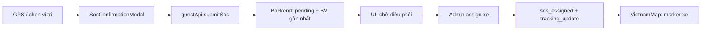

# GeoFrontend

Giao diện web **React + Vite + TypeScript** cho hệ thống cấp cứu khẩn cấp: bản đồ cơ sở y tế (Leaflet), gửi SOS, dashboard điều phối bệnh viện, quản trị Super Admin — kết nối **GeoBackend** qua REST và Socket.IO.

---

## Luồng sử dụng (theo vai trò)

Luồng khớp API backend và các màn hình đã triển khai.

### 1. Người dùng / khách (`/`, `/user`)

1. **Không cần đăng nhập** để xem bản đồ, lọc cơ sở (bệnh viện / phòng khám / nhà thuốc), bật GPS.
2. **Đăng ký / đăng nhập** (`/register`, `/login`) → chuyển hướng theo `role_id`.
3. **Hồ sơ y tế** (`/profile`): họ tên, tuổi, nhóm máu, bệnh nền, dị ứng, SĐT liên hệ khẩn cấp — dữ liệu được backend đính kèm khi gửi SOS (nếu đã lưu).
4. **Gửi SOS**: nút SOS → modal xác nhận vị trí & SĐT → `POST /api/emergency/sos`.
5. **Chờ & theo dõi**: trạng thái `pending` → sau khi admin điều phối nhận `sos_assigned` → bản đồ hiển thị xe realtime qua `tracking_update` (Socket `join_request_room` + `tracking_token`).
6. **Khách (guest)**: có `guest_uuid` trong localStorage; sau đăng nhập có thể **liên kết** phiên SOS ẩn danh với tài khoản (`link-anonymous-session`).

### 2. Admin bệnh viện (`/admin`)

Yêu cầu `role_id = 2` (JWT trong cookie phiên).

1. Dashboard: thống kê xe sẵn sàng / đang nhiệm vụ / ca chờ.
2. **Realtime**: Socket join `join-role-room` với `facility_id` → nhận `sos_alert` (âm thanh + focus bản đồ).
3. Bảng ca cấp cứu: chọn xe → **Điều phối** → `PATCH /api/emergency/:id/assign`.
4. Bản đồ điều phối: marker bệnh nhân + vị trí xe (join từng `request:{id}` khi có `tracking_token`).
5. Quản lý xe cứu thương của BV (thêm biển số, v.v.).

### 3. Super Admin (`/super-admin`)

Yêu cầu `role_id = 1`.

1. Quản lý **cơ sở y tế**: thêm / sửa / lọc theo loại (BV, phòng khám, nhà thuốc).
2. Quản lý **tài khoản Admin BV**: tạo, cập nhật, vô hiệu hóa; gán `facility_id`.

### Điều hướng sau đăng nhập

| `role_id` | Trang mặc định |
|-----------|----------------|
| 1 | `/super-admin` |
| 2 | `/admin` |
| 3 | `/` hoặc `/user` |

Route legacy `/hospital` redirect về `/admin`.

---

## Yêu cầu

| Thành phần | Phiên bản |
|------------|-----------|
| Node.js | 18+ / 20 LTS |
| GeoBackend | Đang chạy tại `http://localhost:3000` (xem [GeoBackend/README.md](../GeoBackend/README.md)) |

---

## Chạy nhanh (dev)

```bash
cd GeoFrontend
npm install
```

Tạo file `.env` từ mẫu:

```bash
cp .env.example .env
```

Khởi động backend (từ thư mục `GeoBackend`):

```bash
npm run infra:up
npm run dev
```

Chạy frontend:

```bash
npm run dev
```

Mở trình duyệt: **http://localhost:5173** (Vite mặc định).

| Mục đích | URL |
|----------|-----|
| Bản đồ / SOS (user & guest) | http://localhost:5173/user |
| Đăng nhập | http://localhost:5173/login |
| Admin BV | http://localhost:5173/admin |
| Super Admin | http://localhost:5173/super-admin |

### Tài khoản thử (sau seed backend)

Xem bảng đầy đủ: [GeoBackend/SEED_ACCOUNTS.md](../GeoBackend/SEED_ACCOUNTS.md).

| Vai trò | Email | Mật khẩu |
|---------|-------|----------|
| Super Admin | `admin@geobackend.com` | `admin123` |
| Admin BV (vd. Chợ Rẫy) | `admin.cho-ray@geobackend.com` | `BvAdmin123` |
| User | *(đăng ký tại `/register`)* | *(tự đặt)* |

**Gợi ý demo:** mở 3 tab — User (gửi SOS) → Admin BV cùng `facility_id` với BV được gán → Super Admin.

---

## Script npm

| Lệnh | Mô tả |
|------|--------|
| `npm run dev` | Dev server Vite (HMR) |
| `npm run build` | `tsc` + build production |
| `npm run preview` | Xem bản build |
| `npm run test:e2e` | Playwright (cần backend + FE; xem `playwright.config.js`) |

E2E mặc định `baseURL` http://localhost:5173, tự khởi động `npm run dev` nếu chưa có server.

---

## Cấu trúc mã nguồn

```
src/
├── route/routes.tsx       # React Router + guard theo role
├── pages/
│   ├── UserPage.tsx       # Bản đồ, SOS, tracking user
│   ├── HospitalDashboardPage.tsx
│   ├── SuperAdminDashboardPage.tsx
│   ├── LoginPage.tsx / RegisterPage.tsx / ProfilePage.tsx
├── components/            # Bản đồ, SOS modal, bảng ca, toast
├── services/
│   ├── auth.ts            # Cookie phiên, refresh token
│   ├── guestApi.ts        # Cơ sở, SOS
│   ├── adminApi.ts        # Admin & Super Admin
│   └── profileApi.ts
├── hooks/
│   └── useTrackingSocket.ts
└── context/               # Reconcile SOS ẩn danh sau login
```

---

## Tích hợp backend

| Biến | Mục đích |
|------|----------|
| `VITE_API_URL` | Gốc REST (`/api/...`) |
| `VITE_WS_URL` | Origin Socket.IO (cùng host API, protocol `http`/`https`) |
| `VITE_GOOGLE_CLIENT_ID` | Nút Google trên login/register |
| `VITE_USE_MOCK=true` | Bỏ qua API thật; dùng `mocks/mockBackend.ts` |

Phiên đăng nhập lưu trong **cookie** `geo_auth_session` (không còn localStorage cho JWT). Route guard tự **refresh** access token khi hết hạn.

### Sự kiện Socket (phía FE)

- **User tracking:** `useTrackingSocket` — `join_request_room`, lắng nghe `tracking_update`, `sos_assigned`, `tracking_ended`.
- **Admin:** `HospitalDashboardPage` — `join-role-room`, `sos_alert`, join từng ca đang active.

Chi tiết sự kiện: [GeoBackend/README.md](../GeoBackend/README.md#socketio-cùng-cổng-http).

---

## Luồng kỹ thuật SOS (tóm tắt)



- Vùng hỗ trợ: kiểm tra phía client (`supportedArea`) và backend (`isInSupportedArea`).
- Sau điều phối, ETA và polyline route lấy từ response / socket payload.

---

## Build production

```bash
npm run build
```

Đặt `VITE_API_URL` / `VITE_WS_URL` trỏ tới API production trước khi build. Phục vụ tĩnh qua `npm run preview` hoặc reverse proxy (Nginx, v.v.).

---

## Tài liệu liên quan

- [GeoBackend/README.md](../GeoBackend/README.md) — API, Socket, seed
- [GeoBackend/SEED_ACCOUNTS.md](../GeoBackend/SEED_ACCOUNTS.md) — Tài khoản & bệnh viện
- [GeoBackend/HUONG_DAN_CHAY_BACKEND.md](../GeoBackend/HUONG_DAN_CHAY_BACKEND.md) — Chạy Postgres/Redis
